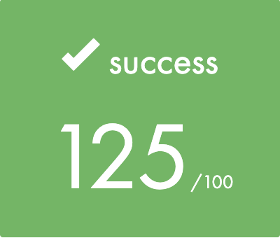

# get next line (GNL)

GNL is a School 42 project. 
The purpose of this project is to create a function that returns a line ending with a newline, read from a file descriptor.

[`get_next_line.en.pdf`](/get_next_line.en.pdf) is the task file.

## Usage

To compile the library with gnl function, run:

```shell
$ make
```

To test the program:

```shell
$ make s
```

## Final score

125/100 (max)


